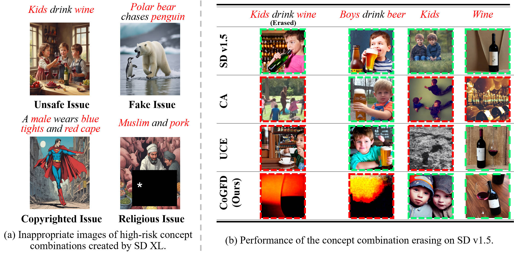
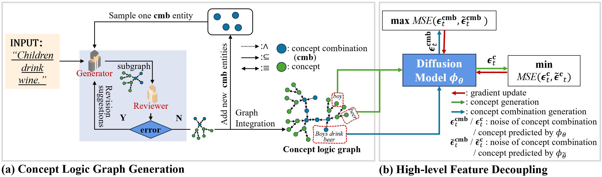

# CoGFD: Concept Graph-based Feature Decoupling for Concept Combination Erasing

## Overview

This project implements the solution for the Concept Combination Erasing (CCE) problem proposed in the paper. Through the Concept Graph-based Feature Decoupling framework (CoGFD), we can effectively erase inappropriate visual concept combinations from text-to-image diffusion models while minimizing adverse effects on the generative fidelity of related individual concepts.


*Figure 1: Research motivation and problem illustration for Concept Combination Erasing*

## Project Structure

```
CoGFD/
├── concept_combination_erasing.py    # Main finetuning script implementing CoGFD framework
├── logic_graph_iter_construct.py     # Concept logic graph construction module
├── image_generation.py               # Image generation script
├── erase_eval.py                     # Erasing effect evaluation script
├── prompt_generator_large.py         # Prompt generator
├── img_prepare.py                    # Image data preparation script
├── run.sh                            # Complete workflow execution script
├── config.py                         # Configuration file with paths and API settings
├── pretrained_models/                # Pretrained model storage directory
│   └── stable-diffusion-v1-5/       # Stable Diffusion v1.5 model
├── HarmfulCmb/                       # Harmful concept combination (HarmfulCmb) data directory
├── output/                           # Main output directory (organized by concept combination)
│   └── {concept_combination}/        # Specific concept combination results
│       ├── concept_logic_graph/      # Generated concept logic graphs
│       ├── model_finetune/           # Fine-tuned model storage
│       ├── data/                     # Prepared finetuning data
│       ├── img_generation/           # Generated images storage
│       └── eval_results/             # Evaluation results storage
└── requirements.txt                  # Python dependencies
```

## Framework Architecture

The CoGFD (Concept Graph-based Feature Decoupling) framework consists of multiple components working together to achieve effective concept combination erasing:


*Figure 2: CoGFD framework architecture showing the logic concept graph construction and high-level feature decoupling process*


## Installation Requirements

### Environment Dependencies

```bash
# Basic dependencies
torch>=1.9.0
torchvision>=0.10.0
diffusers>=0.21.0
transformers>=4.21.0
accelerate>=0.20.0
PIL
numpy
tqdm

# Evaluation dependencies
clip-score
pytorch-lightning

# LLM interaction dependencies
autogen
openai

# Other tools
argparse
json
pathlib
```

### Installation Steps

1. Clone the repository:
```bash
git clone https://github.com/Sirius11311/CoGFD-ICLR25.git
cd CoGFD-ICLR25
```

2. Install dependencies:
```bash
pip install -r requirements.txt
```

3. Configure API settings:
   
   Edit `config.py` to set your OpenAI API credentials:
   ```python
   OPENAI_API_KEY = "your-openai-api-key"
   BASE_URL = "your-openai-base-url"
   ```

4. Download pretrained models:
   
   Place the Stable Diffusion v1.5 model in the `pretrained_models/stable-diffusion-v1-5/` directory, or update the `PRETRAINED_MODEL_PATH` in `config.py` to point to your model location.

## Configuration

The project uses `config.py` for centralized configuration management:

- **OPENAI_API_KEY**: Your OpenAI API key for LLM interactions
- **BASE_URL**: OpenAI API base URL
- **PROJECT_ROOT**: Automatically set to the project directory
- **PRETRAINED_MODEL_PATH**: Path to Stable Diffusion v1.5 model
- **HARMFUL_CMB_DIR**: Directory for harmful combination data
- **OUTPUT_DIR**: Main output directory (organized by concept combination)
- **LOGICGRAPH_DIR**: Concept logic graph storage
- **FINETUNE_MODEL_DIR**: Fine-tuned model storage
- **PREPARED_DATA_DIR**: Training data storage
- **GENERATED_IMG_DIR**: Generated images storage
- **EVAL_RESULTS_DIR**: Evaluation results storage

## Usage

### Complete Workflow

For a complete concept combination erasing workflow, you can use the provided shell script:

```bash
chmod +x run.sh
./run.sh
```

Or follow the step-by-step process below:

### 1. Image Data Preparation

Prepare training images for the concept combination:

```bash
CUDA_VISIBLE_DEVICES=0 python img_prepare.py \
    --concept_combination "underage_and_alcohol"
```

### 2. Model Training (Concept Combination Erasing)

Use the CoGFD framework to train the model to erase specific concept combinations:

```bash
CUDA_VISIBLE_DEVICES=0,1 python concept_combination_erasing.py \
    --combine_concept_x "underage_and_alcohol" \
    --combine_theme_y "normal_life" \
    --p1 -1 \
    --p2 1 \
    --lr 2.5e-5 \
    --max-steps 130 \
    --only_xa \
    --iterate_n 2 \
    --start 990 \
    --end 1000 \
    --train_batch_size 20
```

**Parameter Explanation:**
- `--combine_concept_x`: The concept combination to be erased
- `--combine_theme_y`: The theme context for training
- `--p1`, `--p2`: Penalty parameters for the loss function
- `--lr`: Learning rate
- `--max-steps`: Maximum training steps
- `--only_xa`: Only optimize cross-attention layers
- `--iterate_n`: Number of iterations for the training process
- `--start`, `--end`: Timestep range for diffusion process
- `--train_batch_size`: Training batch size

### 3. Image Generation

Generate reference images and fine-tuned images:

```bash
CUDA_VISIBLE_DEVICES=0 python image_generation.py \
    --concept_combination "underage_and_alcohol" \
    --prompt_generate \
    --seed 188 \
    --generate_ref \
    --sub_concepts "underage" "alcohol"
```

**Parameter Explanation:**
- `--concept_combination`: The concept combination name
- `--prompt_generate`: Generate prompts automatically
- `--seed`: Random seed for reproducible generation
- `--generate_ref`: Generate reference images from original model
- `--sub_concepts`: Individual concepts for evaluation

### 4. Effect Evaluation

Evaluate the erasing effect:

```bash
python erase_eval.py \
    --concept_combination "underage_and_alcohol"
```

### Customizing for Different Concept Combinations

To run the workflow for different concept combinations, modify the variables in `run.sh`:

```bash
# Define your concept combination
COMBINE_CONCEPT="your_concept_combination"
COMBINE_THEME="your_theme"
SUB_CONCEPTS=("concept1" "concept2")
CUDA_DEVICES_1="0"      # Single GPU for data prep and generation
CUDA_DEVICES_2="0,1"    # Multiple GPUs for finetuning
```


## Directory Structure After Running

After running the finetuning and generation scripts, your output directory will be organized as follows:

```
output/
└── {concept_combination}/
    ├── concept_logic_graph/      # Logic graph files
    ├── model_finetune/           # Fine-tuned model checkpoints
    ├── data/                     # Prepared finetuning data
    ├── img_generation/           # Generated images
    │   ├── reference/            # Reference images
    │   └── finetuned/           # Fine-tuned model images
    └── eval_results/            # Evaluation results and metrics
```

## Citation

If you use this code, please cite the related paper:

```bibtex
@inproceedings{nieerasing,
  title={Erasing concept combination from text-to-image diffusion model},
  author={Nie, Hongyi and Yao, Quanming and Liu, Yang and Wang, Zhen and Bian, Yatao},
  booktitle={The Thirteenth International Conference on Learning Representations}
}
```
